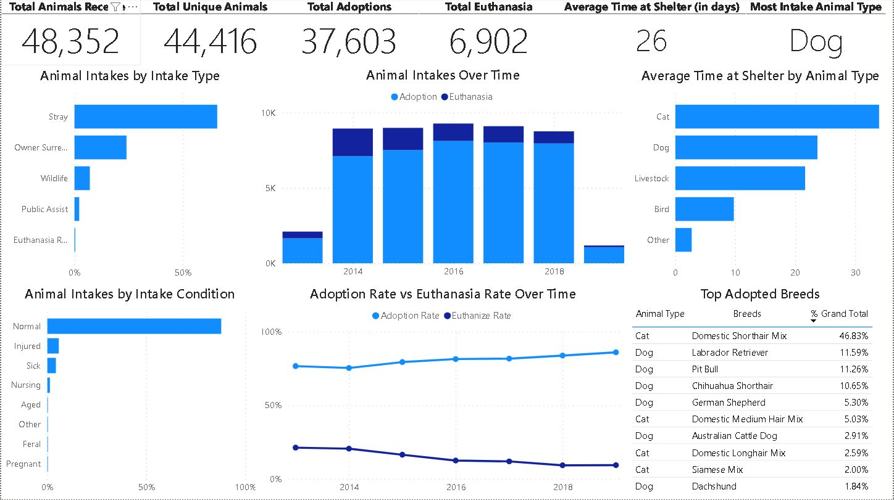
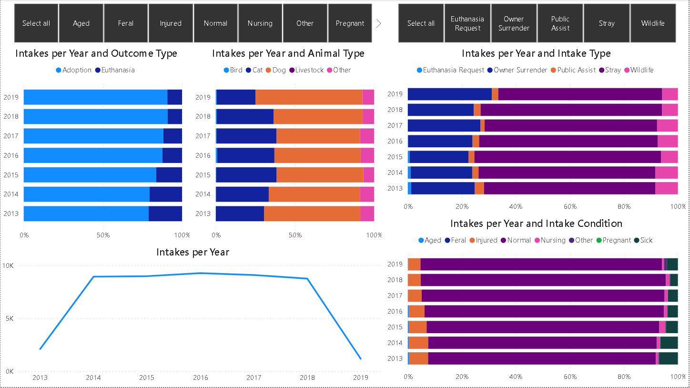
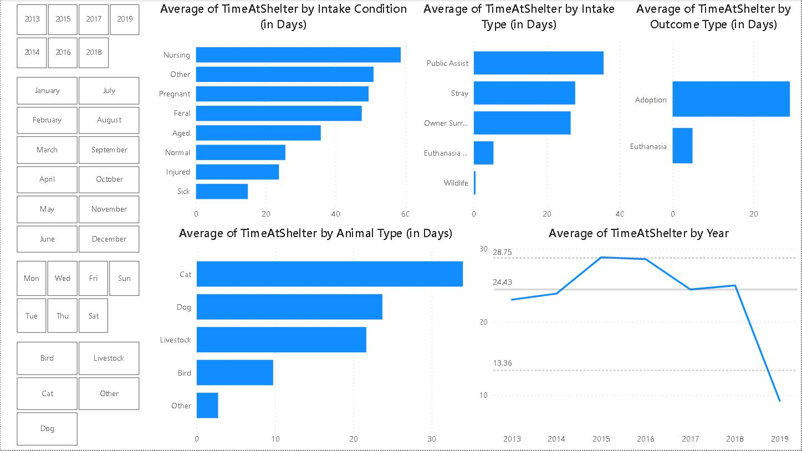

# Predicting the Sale Price of Bulldozers using Machine Learning
> This dataset has been created to analyze and determine the factors that contribute to an animal being euthanized or adopted in an animal shelter. The goal is to provide insights that can help improve adoption rates and reduce euthanasia rates by understanding the key attributes that influence these outcomes.

## 1. Problem defition
What are the deterministic factors in an animal being euthanized or adopted?

## 2. Dataset Contents
The dataset includes the following files:

* AnimalShelter.xlsx: The main dataset containing records of animals admitted to the shelter.
* AnimalShelter.ipynb: Contains EDA Analysis & predictive model
* AnimalShelter.pbix: Contains dashboards of insights generated

## 3. Features
The dataset contains the following columns:

* Animal ID: A unique identifier for each animal.
* Name: The name of the animal (if available).
* DateTime: The date and time the animal was admitted to the shelter.
* Outcome Type: The outcome for the animal (e.g., Adoption, Euthanasia, Transfer, Return to Owner).
* Outcome Subtype: Additional details about the outcome (if available).
* Animal Type: The type of animal (e.g., Dog, Cat, Bird).
* Sex upon Outcome: The gender and reproductive status of the animal at the time of outcome (e.g., Neutered Male, Spayed Female).
* Age upon Outcome: The age of the animal at the time of outcome.
* Breed: The breed of the animal.
* Color: The color pattern of the animal.
* Intake Type: The reason for the animal's intake (e.g., Stray, Owner Surrender, Public Assist).
* Intake Condition: The condition of the animal at the time of intake (e.g., Normal, Injured, Sick).
* Date of Birth: The date of birth of the animal.
* Outcome Date: The date when the outcome occurred.

## 4. Usage
The dataset can be used for the following purposes:

* **Predictive Analysis:*** Building models to predict the likelihood of adoption or euthanasia based on the given attributes.
* **Descriptive Analysis:** Understanding trends and patterns in animal intake and outcomes.
* **Operational Improvements:** Identifying factors that could be addressed to improve adoption rates and reduce euthanasia.

## 5. Key Insights
Preliminary analysis has shown that certain factors such as Time At Shelter, Intake Type, and Sex impact the likelihood of an animal being adopted or euthanized. These insights can help shelters focus their efforts on the most influential factors.

## 6. Visuals
The Followings show the visuals created using Power BI:

### Overview

### Demographic

### Outcome Type

### Intake Type

### Time at Shelter

## 7. Analysis Examples
Here are a few examples of how you might analyze this dataset:

* **Logistic Regression:** To determine the probability of adoption versus euthanasia based on factors like age, breed, and intake condition.
* **Decision Trees:** To identify the most important variables influencing the outcome.
* **Survival Analysis:** To study the time-to-event data for animals from intake to outcome.